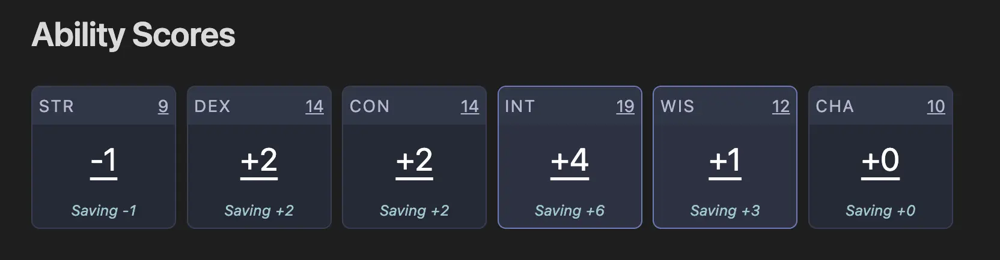

# Ability Scores

The `ability` block is used to generate a 6 column grid of your ability scores and their saving throws. Fill in the code block with your abilities, proficiencies, and any bonuses that are applied to either the ability scores themselves or their saving throws.

Ability scores support **template expressions** that can reference frontmatter values, enabling dynamic character sheets that update automatically when you change values in your document's YAML frontmatter.



## Example

````yaml
```ability
abilities:
  strength: 9
  dexterity: 14
  constitution: 14
  intelligence: 19
  wisdom: 12
  charisma: 10

bonuses:
  - name: Right of Power
    target: strength
    value: 2
    modifies: saving_throw  # Optional: defaults to saving_throw

proficiencies:
  - intelligence
  - wisdom
```
````

## Template Support

::: v-pre
Ability scores can use template expressions to reference frontmatter values. This is particularly useful for maintaining a single source of truth for your character's base ability scores in the document's frontmatter.
:::

### Frontmatter-Based Abilities

::: v-pre
```yaml
---
level: 5
strength: 14
dexterity: 16
constitution: 12
intelligence: 18
wisdom: 13
charisma: 8
---
```

```ability
abilities:
  strength: '{{ frontmatter.strength }}'
  dexterity: '{{ frontmatter.dexterity }}'
  constitution: '{{ frontmatter.constitution }}'
  intelligence: '{{ frontmatter.intelligence }}'
  wisdom: '{{ frontmatter.wisdom }}'
  charisma: '{{ frontmatter.charisma }}'

proficiencies:
  - intelligence
  - wisdom
```
:::

::: tip Template Strings
Always wrap template expressions in quotes when used as YAML values: `'{{ frontmatter.strength }}'`
:::

### Benefits of Template-Based Abilities

- **Single Source of Truth**: Define ability scores once in frontmatter, reference everywhere
- **Automatic Updates**: When frontmatter changes, all dependent components update automatically
- **Cross-Component References**: Other components (badges, stats) can reference the processed ability scores
- **Mathematical Operations**: Combine with template functions for complex calculations

### Template Functions in Abilities

::: v-pre
You can use mathematical functions within ability score templates:

```ability
abilities:
  strength: '{{ add frontmatter.base_strength racial_bonus }}'
  dexterity: '{{ frontmatter.dexterity }}'
  constitution: '{{ subtract frontmatter.constitution 2 }}'  # Curse effect
  intelligence: '{{ frontmatter.intelligence }}'
  wisdom: '{{ frontmatter.wisdom }}'
  charisma: '{{ multiply frontmatter.charisma 1 }}'
```
:::

::: warning Template Limitations
Template expressions in abilities can only reference `frontmatter` values and mathematical functions. They cannot reference other `abilities` or `skills` to prevent circular dependencies.

**Allowed**: `'{{ frontmatter.strength }}'`, `'{{ add frontmatter.base_str 2 }}'`  
**Not allowed**: `'{{ abilities.dexterity }}'`, `'{{ skills.proficiencies }}'`
:::

### Referencing Templated Abilities

::: v-pre
Once processed, templated abilities can be referenced by other components using the normal `abilities.strength` syntax:

```badges
items:
  - label: Initiative
    value: '{{ modifier abilities.dexterity }}'
  - label: Spell Save DC
    value: '{{ add 8 frontmatter.proficiency_bonus (modifier abilities.intelligence) }}'
```
:::

## Configuration

| Property        | Type   | Description                                                                              |
| --------------- | ------ | ---------------------------------------------------------------------------------------- |
| `abilities`     | Object | Ability score values (strength, dexterity, constitution, intelligence, wisdom, charisma). Can be numbers or template strings referencing frontmatter |
| `bonuses`       | Array  | List of bonuses to apply to ability scores or saving throws                              |
| `proficiencies` | Array  | List of abilities you are proficient in for saving throws                                |

### Bonus Object

| Property   | Type   | Description                                                                  |
| ---------- | ------ | ---------------------------------------------------------------------------- |
| `name`     | String | Name of the bonus (for display purposes)                                     |
| `target`   | String | Which ability the bonus applies to                                           |
| `value`    | Number | The bonus value to add                                                       |
| `modifies` | String | Optional. Either `"score"` or `"saving_throw"`. Defaults to `"saving_throw"` |
