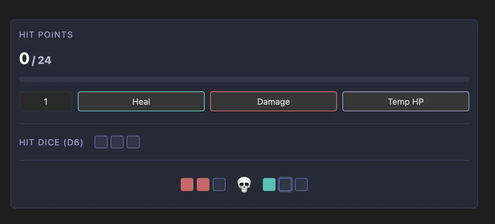

# Health Points

Your Players HP can be tracked using the `healthpoints` widget. This widget requires a `state_key` be provided so that the plugin can save the character's state within the plugins state file.

::: warning State Key Requirement
Each `state_key` defined in **any** component needs to be unique as they are all stored within the same key value store internally.
:::

## Features

- Customize 'Hit Points' label
- Death save tracking
- Supports temporary HP
- Supports **Reset Events** - See [Event System](../concepts/event-systems.md) for more details. By default it is configured for `long-rest`.

## Image



## Example

````yaml
```healthpoints
state_key: din_health
health: 24
hitdice:
  dice: d6
  value: 4
```
````

::: tip
This `health` key supports dynamic content. This allows you to read your HP from frontmatter.

````yaml
```healthpoints
state_key: din_health
health: '{{ frontmatter.hp }}'
hitdice:
  dice: d6
  value: 4
```
````

:::

## Configuration

| Property      | Type         | Default      | Description                         |
| ------------- | ------------ | ------------ | ----------------------------------- |
| `state_key`   | String       | **Required** | Unique identifier for state storage |
| `health`      | Number       | **Required** | Maximum health points               |
| `label`       | String       | "Hit Points" | Custom label for the component      |
| `hitdice`     | Object       | null         | Hit dice configuration              |
| `death_saves` | Boolean      | true         | Whether to show death saves         |
| `reset_on`    | String/Array/Object | "long-rest"  | Events that reset health     |

### Reset Configuration

The `reset_on` property supports the same formats as [consumables](../components/consumables.md#reset-configuration):

**Simple String**: Complete reset on the specified event
```yaml
reset_on: long-rest
```

**Array of Strings**: Complete reset on any of the specified events
```yaml
reset_on: ["short-rest", "long-rest"]
```

**Array of Objects**: Fine-grained control (currently health always resets completely)
```yaml
reset_on:
  - event: long-rest  # Complete reset
```

### Hit Dice Object

| Property | Type   | Description                         |
| -------- | ------ | ----------------------------------- |
| `dice`   | String | Dice type (e.g., "d6", "d8", "d10") |
| `value`  | Number | Number of hit dice available        |
